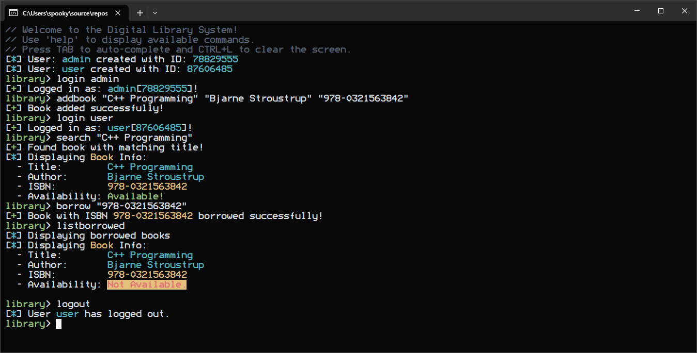

# Digital Library Management System 📚💻

Welcome to the **Digital Library Management System**! This project is designed to manage users (librarians and members), books, and borrowing operations in a digital library. It allows seamless addition, removal, and search of books, user login functionality, and more.

  <!-- Replace with your screenshot -->

---

## Table of Contents 📜
1. [Features](#features)
2. [Getting Started](#getting-started)
3. [Code Examples](#code-examples)
4. [Commands Overview](#commands-overview)

---

## Features ✨

- **User Authentication:** Login as a librarian or member.
- **Book Management:** Add, remove, and search books.
- **Borrowing System:** Borrow and return books.
- **Dynamic Help System:** Access detailed help and examples for every command.
- **Command History:** Execute previous commands using history.

---

## Getting Started 🚀

To get started with the Digital Library, clone the repository and build the application using your favorite C++ environment.

### Prerequisites

- C++14
- Visual Studio
- Optional: A terminal with support for colored output (for a better experience)

### Installation

1. Clone the repository:
   ```bash
   git clone https://github.com/SpookySec/DigitalLibrary.git
   ```

2. Build the project:
   Open the `.sln` file in Visual Studio and click Build (Ctrl + Shift + B)
  

3. Run the application:
   ```bash
   .\DigitalLibrary.exe
   ```

---

## Code Examples 💻

### Logging In

To log in as a librarian or a member, use the following command:

```cpp
login <role>
```

Example:
```bash
login librarian
```

### Adding a User

You can add a new user (either a librarian or member) by using:

```cpp
adduser <role> <name>
```

Example:
```bash
adduser John librarian
```

### Adding a Book

To add a new book to the library, use:

```cpp
addbook <title> <author> <isbn>
```

Example:
```bash
addbook "C++ Programming" "Bjarne Stroustrup" "978-0321563842"
```

### Searching for a Book

To search for a book by its title, use:

```cpp
search <title>
```

Example:
```bash
search "C++ Programming"
```

---

## Commands Overview 🛠️

Here’s a summary of all the commands available in the Digital Library:

| Command          | Description                                                            | Example Usage                           |
|------------------|------------------------------------------------------------------------|-----------------------------------------|
| `login <role>`    | Login as either a 'librarian' or 'member'.                             | `login librarian` or `login member`     |
| `adduser`         | Add a new 'librarian' or 'member' user.                                | `adduser John librarian`                |
| `displayusers`    | Display all registered users.                                          | `displayusers`                          |
| `displaybooks`    | Display all books in the library.                                      | `displaybooks`                          |
| `addbook`         | Add a new book to the library.                                         | `addbook "C++ Programming" "Bjarne Stroustrup" "978-0321563842"` |
| `removebook`      | Remove a book from the library by its ISBN.                            | `removebook "978-0321563842"`           |
| `search`          | Search for a book by its title.                                        | `search "C++ Programming"`              |
| `borrow`          | Borrow a book from the library using its ISBN.                         | `borrow "978-0321563842"`               |
| `return`          | Return a borrowed book by its ISBN.                                    | `return "978-0321563842"`               |
| `listborrowed`    | List books currently borrowed by the logged-in member.                 | `listborrowed`                          |
| `current`         | Display the currently logged-in user.                                  | `current`                               |
| `logout`          | Logout the current user.                                               | `logout`                                |

---
